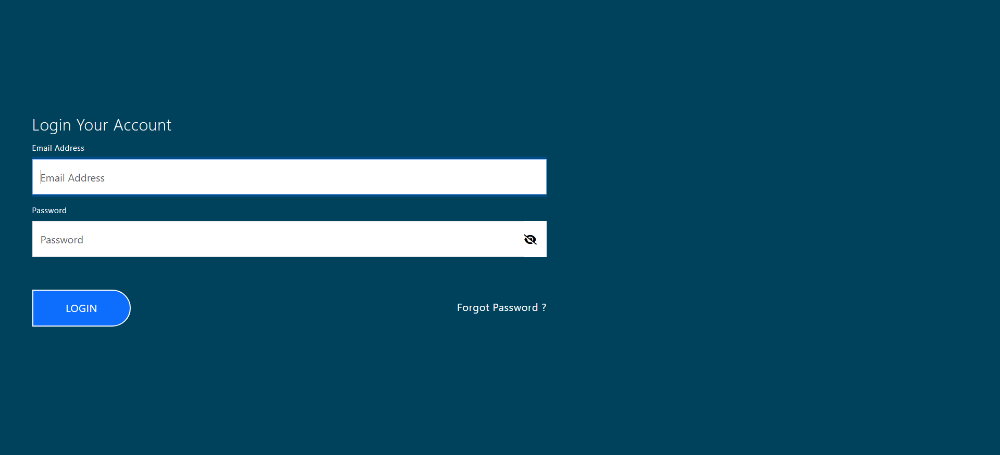
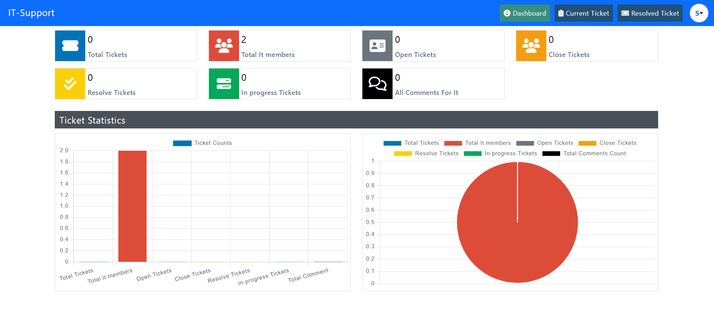
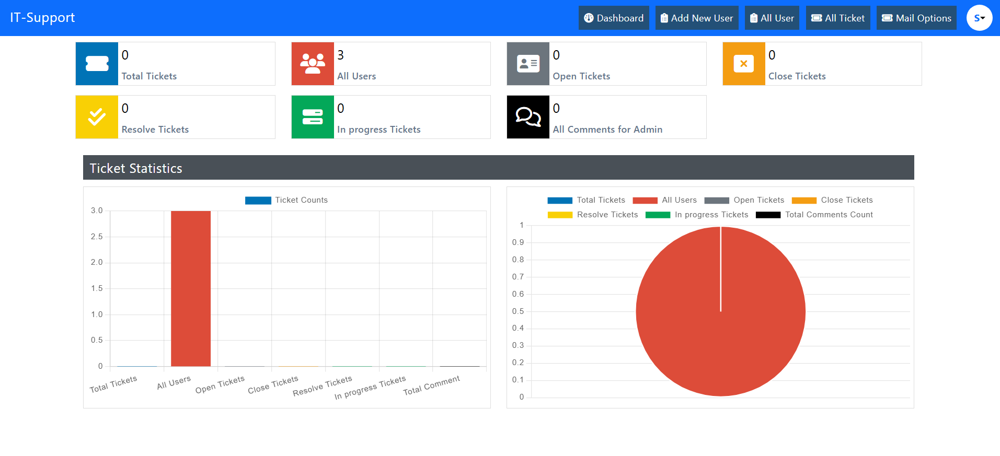
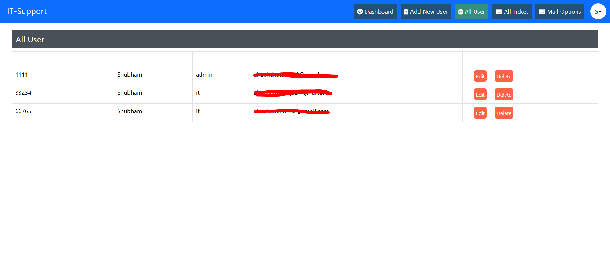
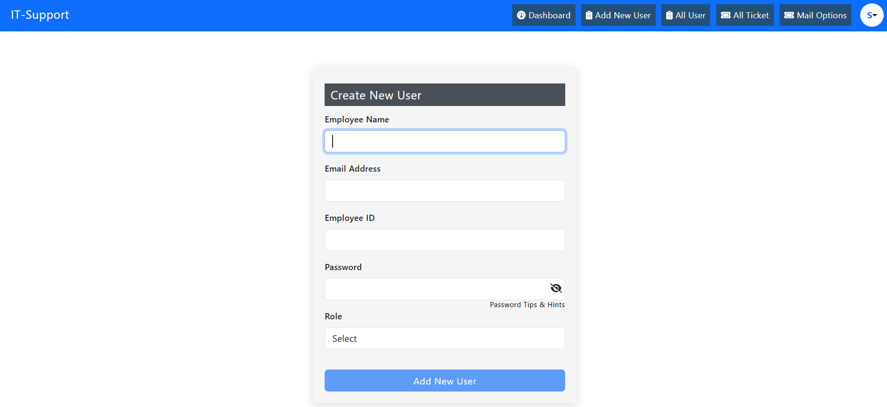
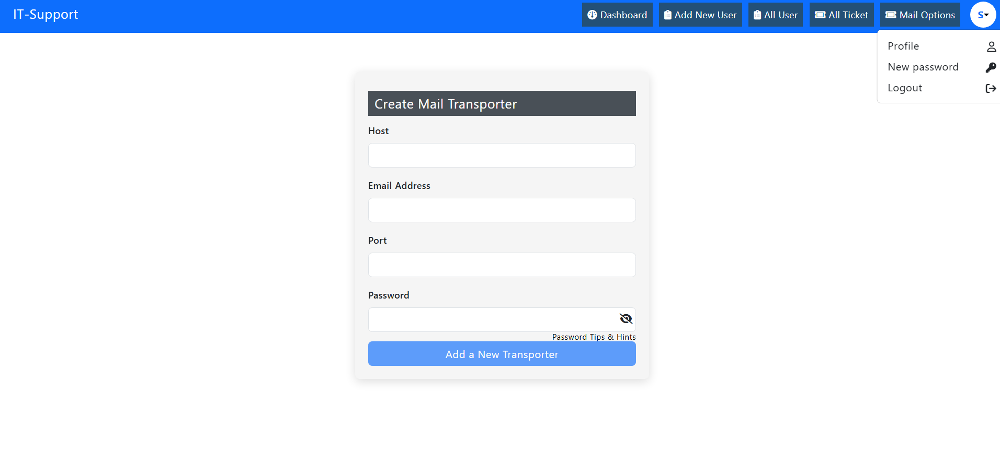

# IT-Support Management System

A web application for managing IT support tickets, users, and admin operations.

## Features

- **Login Page**: Secure authentication for users and admins.
- **User Dashboard**: View and manage your tickets.
- **Admin Dashboard**: Manage users, tickets, and send emails.

## Screenshots

### Login Page


### User Dashboard


### Admin Dashboard 


#### All Users


#### Add New User


#### Email Options


## Getting Started

1. Clone the repository.
2. Install dependencies:
   ```bash
   npm install
   ```
3. Start the frontend:
   ```bash
   npm start
   ```
4. Start the backend:
   ```bash
   npm start
   ```

## Technologies Used

- React
- Node.js
- Express
- MongoDB

## Folder Structure

- `frontend/` - React app
- `backend/` - Node.js/Express API

## License

MIT
